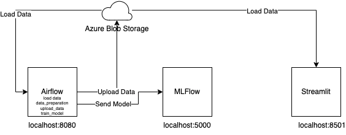

# Immobilienpreisvorhersage-Projekt

Das Immobilienpreisvorhersage-Projekt hat das Ziel, eine Vorhersage der Immobilienpreise auf Basis von öffentlich verfügbaren Daten von [data.gv.at](https://www.data.gv.at/katalog/dataset/c307f89d-b01a-4da2-9f9e-cf3fd2dd651e) durchzuführen. Dieses Projekt legt den Schwerpunkt auf die Erstellung einer effizienten Datenverarbeitungspipeline und die Verwendung der Model Registry. Der R^2-Wert der Modelle kann variieren, da die Hauptzielsetzung auf der Automatisierung und Orchestrierung von ML-Workflows liegt.

Für das Projekt ist nur der airflow_mlflow Ordner relevant! 


## Basis:
Als Basis dient: [github.com/astronomer](https://github.com/astronomer/airflow-llm-demo/tree/main)

## Features

- Orchestrierung von Workflows mit Apache Airflow.
- Nutzung der Features von MLflow zur Modellverwaltung und -verfolgung.
- Erstellung einer interaktiven Benutzeroberfläche mit Streamlit zur Anzeige von Ergebnissen und zur einfachen Bedienung der Anwendung.

## Architektur


## Voraussetzungen

Um das Projekt erfolgreich auszuführen, müssen Sie die folgenden Umgebungsvariablen in einer `docker-compose.override.yml`-Datei festlegen:
```
AZURE_ACCOUNT_NAME: 'mldatarealestate'
AZURE_ACCOUNT_KEY: 'YOUR_KEY'
AZURE_CONTAINER_NAME: 'mldata'
```

## Anleitung

1. Laden Sie Docker herunter und installieren Sie es: [Docker Installationsanleitung](https://docs.docker.com/get-docker/).

2. Installieren Sie `astro` (Astro CLI) auf Ihrem System:

   ```bash
   # Für MacOS
   brew install astro
   ```

    ```bash
    # Für Linux
    curl -sSL install.astronomer.io | sudo bash -s
    ```

3. Starten Sie die Anwendung mit dem folgenden Befehl:

    ```bash
    astro dev start
    ```

4. Services:      
- Streamlit:[http://localhost:8501](http://localhost:8501)
- Airflow: [http://localhost:8080](http://localhost:8080) Benutzername ist admin und Passwort admin
- MLFlow: [http://localhost:5000](http://localhost:5000)


## Datensatz
### Abkürzungen im Dataset
| Code | Ganzer Name |
|--------------|-----------|
| KG.Code | Katastralgemeindenummer (Cadastre Municipality Number) |
| Katastralgemeinde | Katastralgemeindename (Cadastre Municipality Name) |
| EZ | Einlagezahl (Deposit Number) |
| PLZ | Postleitzahl (Postal Code) |
| ON | Orientierungsnummer (Orientation Number) |
| Gst. | Grundstücksnummer (Property Number) |
| Gst.Fl. | Grundstücksfläche (Land Area) |
| ErwArt | Erwerbsart (Acquisition Type: Purchase Agreement, Municipal Council Resolution, etc.) |
| Schutzzone | Schutzzone (Protected Zone) |
| Wohnzone | Wohnzone (Residential Zone) |
| ÖZ | Örtliches Raumordnungsprogramm (Local Spatial Planning Program) |
| Bausperre | Bausperre (Building Restriction) |
| parz. | parzelliert (parceled), unparzelliert (not parceled) |
| VeräußererCode | Veräußerercode (Seller Code) see below|
| Erwerbercode | Erwerbercode (Buyer Code) see below |
| Anteile | Anteile (Shares) |
| Zähler | Zähler (Numerator) |
| Nenner | Nenner (Denominator) |
| BJ | Baujahr (Year of Construction) |
| TZ | Tagebuchzahl (Journal Number) |
| €/m² Gfl. | Kaufpreis pro m² Grundfläche in EUR (Purchase Price per Square Meter of Land Area in EUR) |
| Baureifgest | Baureifgestaltung (Development-ready Land) |
| % Widmung | Widmungsanteil (Zoning Share) |
| Baurecht | Baurecht (Building Right) |
| Stammeinlage | Stammeinlage (Capital Stock) |
| sonst_wid | sonstige Widmung (Other Zoning) |
| sonst_wid_prz | Anteil der sonstigen Widmung in % (Share of Other Zoning in %) |

### Käufer/Verkäufer Info

| Code | Ganzer Name |
|------|-----------|
| 1, 2, 4, 5, 6, 7, 10, 11, 12, 14 | Gebietskörperschaften und juristische Personen mit öffentlichem Charakter (e.g., Municipalities, States, Federal Government, Vienna Utilities, Austrian Federal Railways, etc.) |
| 3 | gemeinnützige Bauvereinigungen (e.g., Housing Cooperatives) |
| 8 | juristische Personen des Privatrechtes (e.g., Limited Liability Companies, Partnerships, Corporations, etc.) |
| 9 | Privatperson (Private Individual) |
| 13 | Bescheid Adressaten (e.g., Monetary Payment/Compensation... based on a decision in the course of creating building sites according to building regulations) |
